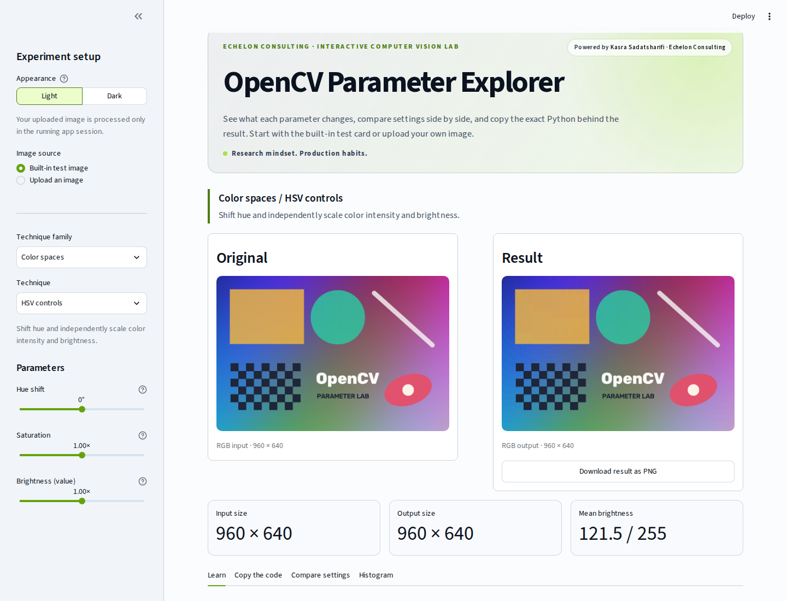

# OpenCV Parameter Explorer

An Echelon Consulting learning lab by Kasra Sadatsharifi.

An interactive learning tool for classical computer vision. Upload an image, adjust an
OpenCV parameter, and see the effect immediately beside the original. Every technique
includes a plain-language explanation, a parameter sweep, a luminance histogram, and a
copy-ready Python example matching the selected settings.

The app turns a collection of image-processing experiments into a structured,
browser-based playground. It is also a working example of Echelon Consulting's approach:
research mindset, production habits, and clear technical communication.

Visitors can send anonymous feedback from inside the app with a quick face rating and
selectable reasons. A written note is optional, and no visitor account, sign-in, or email is
required. The notification recipient is configured outside the repository and is never
displayed publicly.



## What you can explore

| Family | Techniques |
| --- | --- |
| Color spaces | HSV controls, LAB controls |
| Smoothing | Box blur, Gaussian blur, bilateral filtering |
| Edges | Sobel gradients, Canny edges |
| Thresholding | Manual binary threshold, Otsu threshold |
| Contrast | Global histogram equalization, CLAHE |
| Shapes | Canny-based contour detection and area filtering |
| Geometry | Resize/interpolation, rotation, flip, shear |
| Augmentation | Gaussian noise, cutout/random erasing, unsharp masking |

## Run the preview locally

Python 3.11 or newer is recommended.

```bash
python -m venv .venv
source .venv/bin/activate       # Windows: .venv\Scripts\activate
python -m pip install -r requirements.txt
streamlit run app.py
```

Streamlit will print a local address, normally
[`http://localhost:8501`](http://localhost:8501). Nothing is deployed by this command.

## How to use it

1. Start with the built-in test card or upload a JPG, PNG, or WebP image.
2. Use the **Appearance** buttons at the top of the sidebar to choose Light or Dark mode.
3. Choose a technique family and operation in the sidebar.
4. Move the controls and compare the original with the live result.
5. Open **Learn** for parameter guidance, **Compare settings** for a three-value sweep,
   and **Copy the code** to reuse the current OpenCV operation.
6. Download the processed result as a PNG if you want to inspect it elsewhere.
7. Use the feedback form to suggest another technique, report something unclear, or share
   what worked well.

Uploaded images are processed in the running Streamlit session. Files are not stored by
the app. Inputs larger than 1,400 pixels on their longest side are reduced for a responsive
preview.

## Project structure

```text
app.py                         Streamlit interface
src/feedback.py                Private feedback delivery and endpoint validation
src/image_utils.py             Upload handling, sample image, and display helpers
src/operation_registry.py      Technique descriptions and UI parameter definitions
src/operations.py              Reusable OpenCV processing functions
tests/test_feedback.py         Feedback privacy, payload, and failure checks
tests/test_operations.py       Smoke and numeric-safety checks
.streamlit/config.toml         Local and hosted visual theme
```

## Verify the processing layer

```bash
python -m unittest discover -v
```

The test suite renders every registered operation with its default parameters and checks
the numeric safeguards used for color and noise operations.

## Deployment (when ready)

The repository is compatible with Streamlit Community Cloud: select `app.py` as the entry
point and let the service install `requirements.txt`. `opencv-python-headless` is used so
the hosted app does not require desktop GUI libraries.

Deployment is intentionally separate from local development, so the interface can be
reviewed and tested before it becomes public.

### Enable private feedback notifications

1. Create a form at [Formspree](https://formspree.io) and configure its notification email.
2. Copy its endpoint, which looks like `https://formspree.io/f/your-form-id`.
3. In Streamlit Community Cloud, open the app's **Settings → Secrets** and add:

   ```toml
   FORMSPREE_ENDPOINT = "https://formspree.io/f/your-form-id"
   ```

The repository does not contain a secrets file. The real value belongs in Streamlit Community
Cloud's **Secrets** field. For local development only, create `.streamlit/secrets.toml`, which
is excluded by `.gitignore`, and use the same TOML setting shown above.

Only the app owner needs a Formspree account. Visitors remain inside the explorer and submit
anonymously without creating an account or opening a third-party page.

The notification email stays in Formspree and is not stored in the repository or rendered in
the app.

## About Echelon Consulting

Echelon Consulting turns computer-vision and machine-learning questions into measurable
experiments, practical prototypes, and production-ready paths. Learn more at
[echelonconsulting.vercel.app](https://echelonconsulting.vercel.app).
